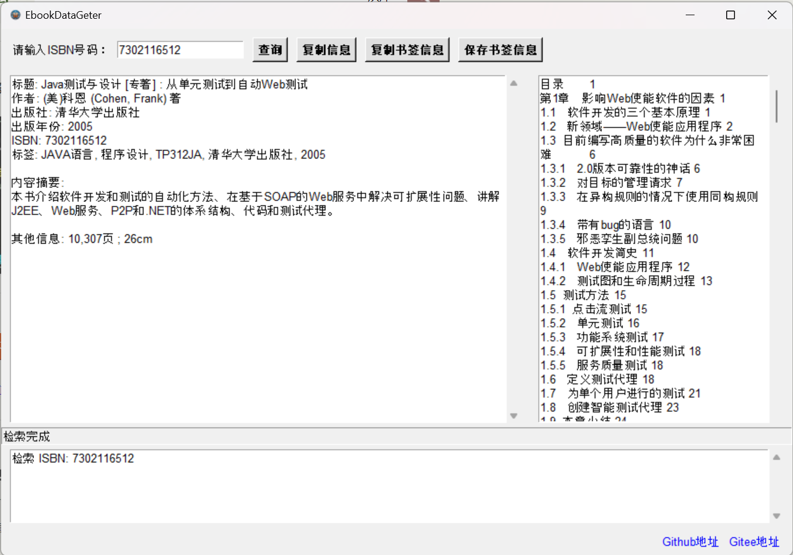

# EbookDataGeter

### 感谢您使用和支持 EbookDataTools系列工具！

EbookDataGeter 是一个基于 [NLCISBNPlugin](https://github.com/DoiiarX/NLCISBNPlugin) 的改进项目，同时也是 EbookDataTools 系列工具的第二个项目，本项目提供了一个简单易用的图书数据获取工具。此项目使用 Tkinter 库构建了一个直观的图形用户界面（GUI），在新版本当中集成了[书葵网](https://www.shukui.net/)的书签检索功能，使得图书信息检索与图书书签检索集成到一起。
  
在此向`NLCISBNPlugin`与`书葵网`的开发者表达感谢！  

## 主要特点  
  
- **图书信息检索**：通过输入 ISBN 号，快速获取图书的详细信息。  
- **书签检索**：可以检索书签集成到PDF当中
- **信息展示**：在界面中清晰展示检索到的图书信息。  
- **剪贴板支持**：方便地复制检索结果到剪贴板，以便于进一步使用。  


### 本地运行

---

#### 方法一 (推荐！使用发布包运行)

1. 下载本项目发布的软件包

2. 解压下载下来的软件包

3. 双击exe一键启动本项目

---

#### 方法二 (使用源代码运行)


1. 打开终端或命令提示符，并导航到您项目的根目录。

2. 创建一个新的虚拟环境，您可以使用以下命令：

```python
python -m venv venv
```

这将在项目根目录中创建一个名为`venv`的新虚拟环境。

3. 激活虚拟环境。在 Windows 上，使用以下命令：

```python
venv\Scripts\activate
```

在 macOS 和 Linux 上，使用以下命令：

```python
source venv/bin/activate
```

激活虚拟环境后，终端前面的提示符会显示虚拟环境名称，表示虚拟环境已经激活。

4. 接下来，安装项目所需的依赖。

5. 最后，运行应用程序。使用以下命令启动应用程序：

```python

python main.py

```
这将在虚拟环境中运行应用程序

---

#### 方法三 (自行打包发行版本运行)

1. 与方法二相同，但是需要使用`cx_Freeze`来打包软件包。

2. 在创建好虚拟环境后，使用以下命令打包软件包：

```python
python setup.py build
```
3. 打包完成后，您可以在`dist`目录下找到打包好的软件包。

---

## 运行截图



## 更新历史

- 1.2: 优化了ISBN输入框。


## 贡献

如果你有任何改进建议或功能请求，欢迎通过 GitHub 的 Issues 或 Pull Requests 来贡献你的想法。

## 许可

本项目遵循 [Apache 2.0](LICENSE)许可协议。